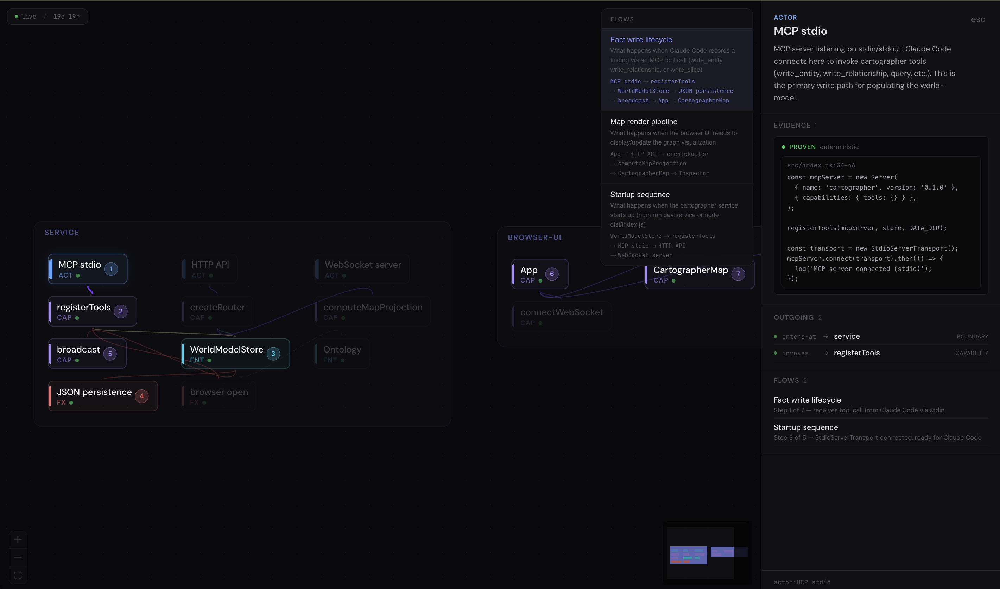

<div align="center">

<br />

# Cartographer

**An agent-first code understanding system.**

Build a persistent, evidence-grounded world-model of any codebase.<br />
Navigate it as a map. Trace behaviors. Inspect evidence down to source.

<br />



<br />

[Getting Started](#getting-started) ·
[How It Works](#how-it-works) ·
[Architecture](#architecture) ·
[Contributing](CONTRIBUTING.md)

<br />
<br />

</div>

---

## The Problem

You understand a codebase by building a mental model — not of files, but of behaviors: what happens when a user signs up, how payments flow, where things can fail. That model lives only in your head. It's rebuilt from scratch every time. It can't be shared, inspected, or queried.

**Cartographer externalizes that model.**

It gives Claude Code a persistent memory of your codebase's behaviors and structure — grounded in source evidence, navigable as a map, and accessible to engineers and non-engineers alike.

## What It Does

```
You: "explore this codebase"

Claude traces the system's key behaviors end-to-end.
Entities emerge from the flows — not from directory structure.
Boundaries form around concerns that break together.

The map shows what the system DOES, not how files are organized.
Each fact links back to the exact source code that proves it.

Open localhost:3847 to see the map.
Click a boundary to zoom in (semantic zoom).
Select a behavior flow to see the path light up.
Ask Claude questions — answers cite the stored model.
```

## Getting Started

### Prerequisites

- [Node.js](https://nodejs.org/) 20+
- [Claude Code](https://docs.anthropic.com/en/docs/claude-code) CLI

### Install via Plugin Marketplace

```
/plugin marketplace add miltonian/cartographer
/plugin install cartographer@cartographer
```

### Install from Source

```bash
git clone https://github.com/miltonian/cartographer.git
cd cartographer
npm install
npm run build:ui
claude --plugin-dir ./plugin
```

### Use

```
/cartographer explore          # Deep autonomous exploration
/cartographer analyze          # Guided analysis (or focused: analyze auth)
/cartographer review-pr 123    # Overlay a PR on the map
/cartographer map              # Open browser UI
/cartographer status           # Model statistics
/cartographer snapshot         # Save a backup
/cartographer restore <file>   # Restore from backup
/cartographer reset            # Start fresh
```

## How It Works

### Three Pieces

```
┌──────────────────────────┐
│  Claude Code + Plugin    │  Agent. Traces behaviors, records findings.
│          │ MCP (stdio)   │
├──────────┼───────────────┤
│  Local Service           │  Backbone. Stores world-model, serves API.
│          │ HTTP + WS     │
├──────────┼───────────────┤
│  Browser UI              │  Map. Renders projections, navigable depth.
└──────────────────────────┘
```

### Behavior-First Analysis

Cartographer leads with **what happens**, not what exists. The agent:

1. Identifies the system's key behaviors ("what are the most important things this system does?")
2. Traces each behavior end-to-end through the code
3. Records entities as they're encountered along the flow
4. Lets boundaries emerge from which entities cluster together

Structure comes from behavior, not from directories.

### The Ontology

| Entity Kind | What It Represents |
|---|---|
| `boundary` | A concern — things that break together |
| `capability` | Something the system can do |
| `actor` | Where external intent enters |
| `entity` | State that persists or transforms |
| `side-effect` | Observable consequence outside the boundary |
| `invariant` | A rule that must hold true |
| `failure-point` | Where the system can fail |

### Evidence, Not Hallucination

Every fact carries source evidence with confidence levels:

| Confidence | Meaning |
|---|---|
| `proven` | Directly observed in source code |
| `high` | One inference step from observed facts |
| `medium` | Synthesized from multiple observations |
| `low` | Educated guess |
| `speculative` | Hypothesis, not yet verified |

The map visually distinguishes all levels. You always know what's proven vs. inferred.

### Behavior Flows

Flows are the primary unit of understanding — a named path through the system:

```
Customer checkout:
  Cart validation → Payment processing → Order creation → Confirmation email
```

Select a flow in the UI panel to see it highlighted on the map. Each step is numbered. Non-participating nodes dim.

### Perspectives

Multiple angles on the same codebase. A perspective is a named lens — a subset of entities in focus.

- **Default** — everything (the satellite view)
- **Agent-created** — focused on a concern ("auth", "data pipeline")
- **Boundary-derived** — created by semantic zoom (clicking into a boundary)

Each perspective has its own layout. Open multiple browser tabs with different perspectives via URL params.

### Semantic Zoom

Click a boundary to enter it. Its children become the world. The breadcrumb shows your path: `Overview › Service › WorldModelStore`. Click back to return. The agent can create deeper levels on request.

### PR Review

```
/cartographer review-pr 123
```

Overlays a PR on the map as a changeset: green (added), amber (modified), red (removed), gray (affected). See the spatial impact of a change at a glance.

### Snapshots

```
/cartographer snapshot before-refactor
/cartographer snapshots
/cartographer restore <filename>
```

Auto-snapshots before destructive operations. Manual snapshots anytime. Keeps last 10.

## MCP Tools

| Tool | Purpose |
|---|---|
| `cartographer_set_project` | Set project root |
| `cartographer_write_entity` | Record an entity with evidence |
| `cartographer_write_relationship` | Record a relationship |
| `cartographer_write_slice` | Record a behavior flow or PR changeset |
| `cartographer_create_perspective` | Create a named lens |
| `cartographer_switch_perspective` | Switch active lens |
| `cartographer_query` | Search entities/relationships |
| `cartographer_get_entity` | Full entity details + evidence |
| `cartographer_get_summary` | Model statistics |
| `cartographer_snapshot` | Save a backup |
| `cartographer_restore` | Restore from backup |
| `cartographer_open_map` | Open browser UI |
| `cartographer_clear` | Reset the world-model |

## Architecture

See [`docs/architecture.md`](docs/architecture.md) for the full system diagram.

Key constraints:
- **Behavior-first** — trace what happens, let structure emerge
- **Agent-first** — Claude Code is the control plane
- **Evidence-grounded** — every claim traces to source
- **Language-agnostic** — the ontology doesn't know about TypeScript or React
- **UI is a projection** — React Flow concepts don't leak into the stored model

## Roadmap

- [ ] Stale entity detection (flag entities whose source has changed)
- [ ] User correction from browser UI (edit descriptions, move boundaries)
- [ ] Capability packs (optional AST extractors for higher-confidence facts)
- [ ] Flow animation (step-through replay)
- [ ] Change impact analysis
- [ ] Large codebase optimization
- [ ] Multi-project support
- [ ] Shareable models

## Philosophy

Most code tools show you what the code says. Cartographer shows you what the code means.

Understanding is behavior prediction. You understand a system when you can predict what happens under change. That requires a model of flows, boundaries, state, invariants, and failure modes — not just a file tree.

The map is not the territory. But a good map makes the territory navigable.

## License

[MIT](LICENSE)

## Contributing

See [CONTRIBUTING.md](CONTRIBUTING.md). The most valuable contribution right now is trying it on your codebase and telling us what's missing.

---

<div align="center">
<br />
<sub>Built with Claude Code.</sub>
<br />
<br />
</div>
